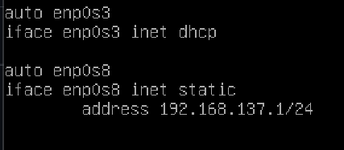

<h2 align="center">Instal Cacti for Debian</h2>
بِسْمِ اللَّهِ الرَّحْمَنِ الرَّحِيْم

## Bahan
- VM OS Debian 

## Penggunaan 

- Konfigurasi Adapter Network pada VM anda dengan dua adapter yaitu NAT dan Host Only
- Konfigurasi Network menjadi dhcp pada adapter NAT/enp0s3 dan Static pada adapter Host Only/enp0s8,
  Contoh :
    
- Tambahkan Repository pada debian, dengan perintah:
  ```
  nano /etc/apt/sources.list
  ```
- Tambahkan baris berikut dibagian paling bawah repository
  ```
  deb http://deb.debian.org/debian buster main contrib non-free
  deb-src http://deb.debian.org/debian buster main contrib non-free
  ```
- Kemudian lakukan update repository
- Lakukan instalasi Cacti dan SNMPD, dengan perintah:
  ```
  apt install cacti snmpd
  ```
- Tunggu hingga proses instalasi selesai kemudian buka cacti dengan ip/cacti dibrowser anda 
